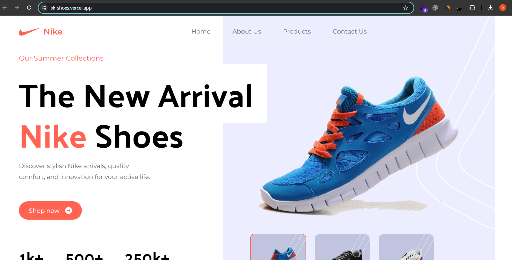
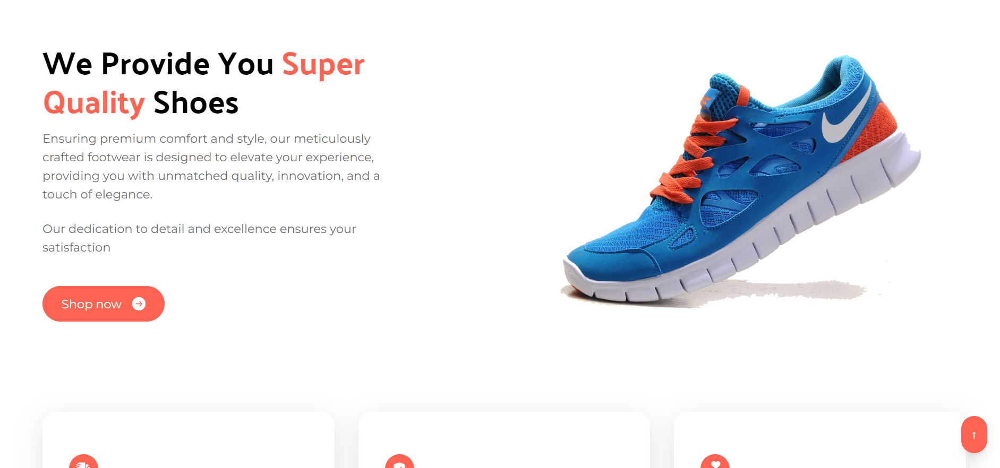

# SK - Shoes

Created with React and Tailwind CSS.

## Live Demo
See the site live: [Sk Shoes](https://sk-shoes.vercel.app)

## Overview
The SK - Shoes Landing Page is a visually appealing and responsive website designed to showcase Nike products. Built with React for dynamic rendering and Tailwind CSS for modern styling, this project aims to provide an engaging user experience for sneaker enthusiasts.

## Features
- Responsive design that adapts to different screen sizes
- Smooth animations and transitions for an enhanced user experience
- Easy navigation through product categories
- High-quality images showcasing Nike products
- Optimized for performance and SEO

## Technologies Used
- **React**: A JavaScript library for building user interfaces.
- **Tailwind CSS**: A utility-first CSS framework for rapid UI development.

 

  
  
  
  
  

